<!-- README.md is generated from README.Rmd. Please edit that file -->

# Generating synthetic adverse event following immunisation (AEFI) data for the VAXTRACE project

<!-- badges: start -->

[](https://www.repostatus.org/#wip)
[](https://github.com/OxfordIHTM/computer-vision-demo/releases/tag/v0.0.0.9000)
[](https://opensource.org/licenses/gpl-3.0.html)
[](https://creativecommons.org/licenses/by/4.0/)
[](https://creativecommons.org/public-domain/cc0/)
<!-- badges: end -->

This repository is a
[`docker`](https://www.docker.com/get-started)-containerised,
[`{targets}`](https://docs.ropensci.org/targets/)-based,
[`{renv}`](https://rstudio.github.io/renv/articles/renv.html)-enabled
[`R`](https://cran.r-project.org/) workflow for generating synthetic
adverse event following immunisation (AEFI) data for the VAXTRACE
project.

## About the Project

\[A DESCRIPTION OF VAXTRACE GOES HERE\]

## Repository Structure

The project repository is structured as follows:

    vaxtrace-synthetic-data
        |-- .github/
        |-- R/
        |-- data-raw/
        |-- data/
        |-- outputs/
        |-- prompts/
        |-- renv/
        |-- reports/
        |-- schemas/
        |-- .Rprofile
        |-- _targets*.R
        |-- packages.R
        |-- renv.lock

- `.github` contains project testing and automated deployment of outputs
  workflows via continuous integration and continuous deployment (CI/CD)
  using Github Actions.

- `R/` contains functions developed/created specifically for use in this
  workflow.

- `data-raw/` contains raw datasets, usually either downloaded from
  source or added manually, that are used in the project.

- `data/` contains intermediate and final data outputs produced by the
  workflow.

- `outputs/` contains compiled reports and figures produced by the
  workflow.

- `prompts/` contains prompts used in the workflow.

- `renv/` contains `renv` package specific files and directories used by
  the package for maintaining R package dependencies within the project.
  The directory `renv/library`, is a library that contains all packages
  currently used by the project. This directory, and all files and
  sub-directories within it, are all generated and managed by the `renv`
  package. Users should not change/edit these manually.

- `reports/` contains literate code for R Markdown and/or Quarto reports
  rendered in the workflow.

- `schemas/` contains JSON data schemas used in the workflow.

- `.Rprofile` file is a project R profile generated when initiating
  `renv` for the first time. This file is run automatically every time R
  is run within this project, and `renv` uses it to configure the R
  session to use the `renv` project library.

- `_targets*.R` files define the steps in the workflow’s data ingest,
  data processing, data analysis, and reporting pipeline.

- `packages.R` file lists out all R package dependencies required by the
  workflow.

- `renv.lock` file is the `renv` lockfile which records enough metadata
  about every package used in this project that it can be re-installed
  on a new machine. This file is generated by the `renv` package and
  should not be changed/edited manually.

## Reproducibility

### System dependencies

This project requires the following system dependencies:

- `quarto`

This project uses v1.9.38 of [`quarto`](https://quarto.org/) open-source
scientific and technical publishing system. Instructions on how to
download and install `quarto` can be found
[here](https://quarto.org/docs/get-started/).

- `ollama`

This project uses [`ollama`](https://ollama.com/) to serve open large
language models locally. Instructions on how to download and install
`ollama` can be found [here](https://ollama.com/download). This project
specifically uses the following open source models available via
`ollama`:

| **Model Name**  | **RAM size** | **Context Window** |
|:----------------|-------------:|-------------------:|
| `gemma4:31b`    |         20GB |     256,000 tokens |
| `qwen3.5:122b`  |         81GB |     256,000 tokens |
| `gpt-oss:120b`  |         65GB |     128,000 tokens |
| `llama4:16x17b` |         67GB |  10,000,000 tokens |

Once `ollama` is installed, pull the mentioned models above into your
local machine. Please note the required random access memory (RAM) sizes
for each of these models and ensure that the machine you are using has
enough RAM to fit these models.

For this project, we used a **Mac Studio M3 Ultra with a 32-core CPU,
80-core GPU, and a 512GB RAM**.

### R version

This project is built using `R 4.6.1`. To manage R versions, it is
recommended to use [`rig`](https://github.com/r-lib/rig) - an R
installation manager - to be able to install multiple versions of R and
switch between them as needed.

### R package dependencies

This project uses the `{renv}` framework to record R package
dependencies and versions. Packages and versions used are recorded in
`renv.lock` and code used to manage dependencies is in the `renv`
directory and other files in the root project directory.

On starting an R session in the working directory of this repository,
first run

``` r
renv::restore()
```

to install R package dependencies. This is only done once when the
project is being initiated for the first time by a user.

### The workflow

The current workflow has the following steps:

``` mermaid
graph LR
  style Graph fill:#FFFFFF00,stroke:#000000;
  subgraph Graph
    direction LR
    xd42e66ad3decaa43(["gemma_model_name"]):::skipped --> xa83e0071a9cae2ed(["gemma_form1_data_generator"]):::queued
    x7a6414ea3d72c787(["prompt_form1_synthetic_data"]):::queued --> xa83e0071a9cae2ed(["gemma_form1_data_generator"]):::queued
    xa83e0071a9cae2ed(["gemma_form1_data_generator"]):::queued --> x97d11b2210c9dff0["gemma_form1_synthetic_data"]:::queued
    x2f94ae86c3dc82fd(["synthetic_data_generation_prompt_list"]):::completed --> x97d11b2210c9dff0["gemma_form1_synthetic_data"]:::queued
    xbd193c6107524228(["output_type_form1_synthetic_data"]):::queued --> x97d11b2210c9dff0["gemma_form1_synthetic_data"]:::queued
    xd42e66ad3decaa43(["gemma_model_name"]):::skipped --> x8a2373b00d4dee5b(["gemma_form2_data_generator"]):::queued
    xd631249566969664(["prompt_form2_synthetic_data"]):::queued --> x8a2373b00d4dee5b(["gemma_form2_data_generator"]):::queued
    x2f94ae86c3dc82fd(["synthetic_data_generation_prompt_list"]):::completed --> x4f03b1614e8d6702["gemma_form2_synthetic_data"]:::queued
    x8a2373b00d4dee5b(["gemma_form2_data_generator"]):::queued --> x4f03b1614e8d6702["gemma_form2_synthetic_data"]:::queued
    xad13a45cf0dcdcd8(["output_type_form2_synthetic_data"]):::queued --> x4f03b1614e8d6702["gemma_form2_synthetic_data"]:::queued
    x167e9ded0377a928(["prompt_form3_synthetic_data"]):::completed --> xc95a0e8b7e274488(["gemma_form3_data_generator"]):::skipped
    xd42e66ad3decaa43(["gemma_model_name"]):::skipped --> xc95a0e8b7e274488(["gemma_form3_data_generator"]):::skipped
    x32126c198b3cd3f7(["output_type_form3_synthetic_data"]):::completed --> xcf9d77edbaa72570["gemma_form3_synthetic_data"]:::completed
    x2f94ae86c3dc82fd(["synthetic_data_generation_prompt_list"]):::completed --> xcf9d77edbaa72570["gemma_form3_synthetic_data"]:::completed
    xc95a0e8b7e274488(["gemma_form3_data_generator"]):::skipped --> xcf9d77edbaa72570["gemma_form3_synthetic_data"]:::completed
    xa73490a10b6544a4(["prompt_form4_synthetic_data"]):::queued --> x609352d7f2392bf7(["gemma_form4_data_generator"]):::queued
    xd42e66ad3decaa43(["gemma_model_name"]):::skipped --> x609352d7f2392bf7(["gemma_form4_data_generator"]):::queued
    x609352d7f2392bf7(["gemma_form4_data_generator"]):::queued --> x9cde86730d9fd88c["gemma_form4_synthetic_data"]:::queued
    xba59aa83d44395da(["output_type_form4_synthetic_data"]):::queued --> x9cde86730d9fd88c["gemma_form4_synthetic_data"]:::queued
    x2f94ae86c3dc82fd(["synthetic_data_generation_prompt_list"]):::completed --> x9cde86730d9fd88c["gemma_form4_synthetic_data"]:::queued
    x7a6414ea3d72c787(["prompt_form1_synthetic_data"]):::queued --> x4f0bdf5e1f47cf2c(["gpt_form1_data_generator"]):::queued
    x37523a36a9dfc345(["gpt_model_name"]):::skipped --> x4f0bdf5e1f47cf2c(["gpt_form1_data_generator"]):::queued
    x2f94ae86c3dc82fd(["synthetic_data_generation_prompt_list"]):::completed --> xb09553cf68160c6b["gpt_form1_synthetic_data"]:::queued
    x4f0bdf5e1f47cf2c(["gpt_form1_data_generator"]):::queued --> xb09553cf68160c6b["gpt_form1_synthetic_data"]:::queued
    xbd193c6107524228(["output_type_form1_synthetic_data"]):::queued --> xb09553cf68160c6b["gpt_form1_synthetic_data"]:::queued
    x37523a36a9dfc345(["gpt_model_name"]):::skipped --> xf7c632fbd4b3de83(["gpt_form2_data_generator"]):::queued
    xd631249566969664(["prompt_form2_synthetic_data"]):::queued --> xf7c632fbd4b3de83(["gpt_form2_data_generator"]):::queued
    x2f94ae86c3dc82fd(["synthetic_data_generation_prompt_list"]):::completed --> x8b1d50ae8813fa86["gpt_form2_synthetic_data"]:::queued
    xad13a45cf0dcdcd8(["output_type_form2_synthetic_data"]):::queued --> x8b1d50ae8813fa86["gpt_form2_synthetic_data"]:::queued
    xf7c632fbd4b3de83(["gpt_form2_data_generator"]):::queued --> x8b1d50ae8813fa86["gpt_form2_synthetic_data"]:::queued
    x37523a36a9dfc345(["gpt_model_name"]):::skipped --> x5048fe4169e9a3e5(["gpt_form3_data_generator"]):::skipped
    x167e9ded0377a928(["prompt_form3_synthetic_data"]):::completed --> x5048fe4169e9a3e5(["gpt_form3_data_generator"]):::skipped
    x32126c198b3cd3f7(["output_type_form3_synthetic_data"]):::completed --> x329fde7cdf80071c["gpt_form3_synthetic_data"]:::queued
    x5048fe4169e9a3e5(["gpt_form3_data_generator"]):::skipped --> x329fde7cdf80071c["gpt_form3_synthetic_data"]:::queued
    x2f94ae86c3dc82fd(["synthetic_data_generation_prompt_list"]):::completed --> x329fde7cdf80071c["gpt_form3_synthetic_data"]:::queued
    x37523a36a9dfc345(["gpt_model_name"]):::skipped --> x14948ac144406cd0(["gpt_form4_data_generator"]):::queued
    xa73490a10b6544a4(["prompt_form4_synthetic_data"]):::queued --> x14948ac144406cd0(["gpt_form4_data_generator"]):::queued
    x14948ac144406cd0(["gpt_form4_data_generator"]):::queued --> x176912e4c41a4aa3["gpt_form4_synthetic_data"]:::queued
    xba59aa83d44395da(["output_type_form4_synthetic_data"]):::queued --> x176912e4c41a4aa3["gpt_form4_synthetic_data"]:::queued
    x2f94ae86c3dc82fd(["synthetic_data_generation_prompt_list"]):::completed --> x176912e4c41a4aa3["gpt_form4_synthetic_data"]:::queued
    x7a6414ea3d72c787(["prompt_form1_synthetic_data"]):::queued --> xc666f3b340312894(["llama_form1_data_generator"]):::queued
    x935cdda349ceab25(["llama_model_name"]):::skipped --> xc666f3b340312894(["llama_form1_data_generator"]):::queued
    xc666f3b340312894(["llama_form1_data_generator"]):::queued --> x95ed1bde7c3003e7["llama_form1_synthetic_data"]:::queued
    xbd193c6107524228(["output_type_form1_synthetic_data"]):::queued --> x95ed1bde7c3003e7["llama_form1_synthetic_data"]:::queued
    x2f94ae86c3dc82fd(["synthetic_data_generation_prompt_list"]):::completed --> x95ed1bde7c3003e7["llama_form1_synthetic_data"]:::queued
    x935cdda349ceab25(["llama_model_name"]):::skipped --> x47608fbfbe3428bf(["llama_form2_data_generator"]):::queued
    xd631249566969664(["prompt_form2_synthetic_data"]):::queued --> x47608fbfbe3428bf(["llama_form2_data_generator"]):::queued
    x47608fbfbe3428bf(["llama_form2_data_generator"]):::queued --> x476af4f7d71cafcf["llama_form2_synthetic_data"]:::queued
    x2f94ae86c3dc82fd(["synthetic_data_generation_prompt_list"]):::completed --> x476af4f7d71cafcf["llama_form2_synthetic_data"]:::queued
    xad13a45cf0dcdcd8(["output_type_form2_synthetic_data"]):::queued --> x476af4f7d71cafcf["llama_form2_synthetic_data"]:::queued
    x935cdda349ceab25(["llama_model_name"]):::skipped --> x8f2349cb95aa2f3c(["llama_form3_data_generator"]):::skipped
    x167e9ded0377a928(["prompt_form3_synthetic_data"]):::completed --> x8f2349cb95aa2f3c(["llama_form3_data_generator"]):::skipped
    x2f94ae86c3dc82fd(["synthetic_data_generation_prompt_list"]):::completed --> x5a6907a7d4c752af["llama_form3_synthetic_data"]:::queued
    x32126c198b3cd3f7(["output_type_form3_synthetic_data"]):::completed --> x5a6907a7d4c752af["llama_form3_synthetic_data"]:::queued
    x8f2349cb95aa2f3c(["llama_form3_data_generator"]):::skipped --> x5a6907a7d4c752af["llama_form3_synthetic_data"]:::queued
    xa73490a10b6544a4(["prompt_form4_synthetic_data"]):::queued --> x8c7e6494a2c7140e(["llama_form4_data_generator"]):::queued
    x935cdda349ceab25(["llama_model_name"]):::skipped --> x8c7e6494a2c7140e(["llama_form4_data_generator"]):::queued
    x2f94ae86c3dc82fd(["synthetic_data_generation_prompt_list"]):::completed --> x71587311fb989fc9["llama_form4_synthetic_data"]:::queued
    xba59aa83d44395da(["output_type_form4_synthetic_data"]):::queued --> x71587311fb989fc9["llama_form4_synthetic_data"]:::queued
    x8c7e6494a2c7140e(["llama_form4_data_generator"]):::queued --> x71587311fb989fc9["llama_form4_synthetic_data"]:::queued
    xea527aecf1216e4d(["prompt_form1_md"]):::queued --> x7a6414ea3d72c787(["prompt_form1_synthetic_data"]):::queued
    x67c0e4a7435652b2(["prompt_form2_md"]):::queued --> xd631249566969664(["prompt_form2_synthetic_data"]):::queued
    x1cbdea0788747642(["prompt_form3_md"]):::completed --> x167e9ded0377a928(["prompt_form3_synthetic_data"]):::completed
    xc0a5a3100ded0278(["prompt_form4_md"]):::queued --> xa73490a10b6544a4(["prompt_form4_synthetic_data"]):::queued
    x7a6414ea3d72c787(["prompt_form1_synthetic_data"]):::queued --> x464fda4f56716c6c(["qwen_form1_data_generator"]):::queued
    x20bc3615a27843ed(["qwen_model_name"]):::skipped --> x464fda4f56716c6c(["qwen_form1_data_generator"]):::queued
    xbd193c6107524228(["output_type_form1_synthetic_data"]):::queued --> x325f765d48136efd["qwen_form1_synthetic_data"]:::queued
    x2f94ae86c3dc82fd(["synthetic_data_generation_prompt_list"]):::completed --> x325f765d48136efd["qwen_form1_synthetic_data"]:::queued
    x464fda4f56716c6c(["qwen_form1_data_generator"]):::queued --> x325f765d48136efd["qwen_form1_synthetic_data"]:::queued
    xd631249566969664(["prompt_form2_synthetic_data"]):::queued --> xbb45be8776627627(["qwen_form2_data_generator"]):::queued
    x20bc3615a27843ed(["qwen_model_name"]):::skipped --> xbb45be8776627627(["qwen_form2_data_generator"]):::queued
    xbb45be8776627627(["qwen_form2_data_generator"]):::queued --> x1186a9719c6f8679["qwen_form2_synthetic_data"]:::queued
    x2f94ae86c3dc82fd(["synthetic_data_generation_prompt_list"]):::completed --> x1186a9719c6f8679["qwen_form2_synthetic_data"]:::queued
    xad13a45cf0dcdcd8(["output_type_form2_synthetic_data"]):::queued --> x1186a9719c6f8679["qwen_form2_synthetic_data"]:::queued
    x20bc3615a27843ed(["qwen_model_name"]):::skipped --> x60ed2f036c1cbc38(["qwen_form3_data_generator"]):::skipped
    x167e9ded0377a928(["prompt_form3_synthetic_data"]):::completed --> x60ed2f036c1cbc38(["qwen_form3_data_generator"]):::skipped
    x60ed2f036c1cbc38(["qwen_form3_data_generator"]):::skipped --> x4a6aa30ed756cd46["qwen_form3_synthetic_data"]:::dispatched
    x2f94ae86c3dc82fd(["synthetic_data_generation_prompt_list"]):::completed --> x4a6aa30ed756cd46["qwen_form3_synthetic_data"]:::dispatched
    x32126c198b3cd3f7(["output_type_form3_synthetic_data"]):::completed --> x4a6aa30ed756cd46["qwen_form3_synthetic_data"]:::dispatched
    x20bc3615a27843ed(["qwen_model_name"]):::skipped --> x608f05be2c6142f4(["qwen_form4_data_generator"]):::queued
    xa73490a10b6544a4(["prompt_form4_synthetic_data"]):::queued --> x608f05be2c6142f4(["qwen_form4_data_generator"]):::queued
    x2f94ae86c3dc82fd(["synthetic_data_generation_prompt_list"]):::completed --> x82ddea488b83160c["qwen_form4_synthetic_data"]:::queued
    xba59aa83d44395da(["output_type_form4_synthetic_data"]):::queued --> x82ddea488b83160c["qwen_form4_synthetic_data"]:::queued
    x608f05be2c6142f4(["qwen_form4_data_generator"]):::queued --> x82ddea488b83160c["qwen_form4_synthetic_data"]:::queued
    x7a48759e707a63b8(["synthetic_data_rows"]):::completed --> x2f94ae86c3dc82fd(["synthetic_data_generation_prompt_list"]):::completed
    x72f6a851cebefa43(["synthetic_data_user_prompt"]):::completed --> x2f94ae86c3dc82fd(["synthetic_data_generation_prompt_list"]):::completed
    xd0a85fc91769a844(["synthetic_data_raw_form1"]):::queued --> x945a6fcee29bff82(["synthetic_data_processed_form1"]):::queued
    x945a6fcee29bff82(["synthetic_data_processed_form1"]):::queued --> xba9a578a75872a66(["synthetic_data_processed_form1_csv"]):::queued
    xee1a7b8ba942a927(["synthetic_data_raw_form2"]):::queued --> x48546624f516ebe0(["synthetic_data_processed_form2"]):::queued
    x48546624f516ebe0(["synthetic_data_processed_form2"]):::queued --> x2d286e31906b2627(["synthetic_data_processed_form2_csv"]):::queued
    x04b5d7b449feb997["synthetic_data_raw_flattened_form3"]:::queued --> x27c53e7117787140(["synthetic_data_processed_form3"]):::queued
    x1e2079bb78056b96["synthetic_data_raw_flattened_form4"]:::queued --> xab5f081724f1267c(["synthetic_data_processed_form4"]):::queued
    xab5f081724f1267c(["synthetic_data_processed_form4"]):::queued --> xe4da4b40fb82b9cd(["synthetic_data_processed_form4_csv"]):::queued
    xc3a247eec291fc20(["synthetic_data_raw_form3"]):::queued --> x04b5d7b449feb997["synthetic_data_raw_flattened_form3"]:::queued
    x02e6085fb69eaaf2(["synthetic_data_raw_form4"]):::queued --> x1e2079bb78056b96["synthetic_data_raw_flattened_form4"]:::queued
    x95ed1bde7c3003e7["llama_form1_synthetic_data"]:::queued --> xd0a85fc91769a844(["synthetic_data_raw_form1"]):::queued
    x97d11b2210c9dff0["gemma_form1_synthetic_data"]:::queued --> xd0a85fc91769a844(["synthetic_data_raw_form1"]):::queued
    x325f765d48136efd["qwen_form1_synthetic_data"]:::queued --> xd0a85fc91769a844(["synthetic_data_raw_form1"]):::queued
    xb09553cf68160c6b["gpt_form1_synthetic_data"]:::queued --> xd0a85fc91769a844(["synthetic_data_raw_form1"]):::queued
    x1186a9719c6f8679["qwen_form2_synthetic_data"]:::queued --> xee1a7b8ba942a927(["synthetic_data_raw_form2"]):::queued
    x4f03b1614e8d6702["gemma_form2_synthetic_data"]:::queued --> xee1a7b8ba942a927(["synthetic_data_raw_form2"]):::queued
    x476af4f7d71cafcf["llama_form2_synthetic_data"]:::queued --> xee1a7b8ba942a927(["synthetic_data_raw_form2"]):::queued
    x8b1d50ae8813fa86["gpt_form2_synthetic_data"]:::queued --> xee1a7b8ba942a927(["synthetic_data_raw_form2"]):::queued
    x4a6aa30ed756cd46["qwen_form3_synthetic_data"]:::dispatched --> xc3a247eec291fc20(["synthetic_data_raw_form3"]):::queued
    x329fde7cdf80071c["gpt_form3_synthetic_data"]:::queued --> xc3a247eec291fc20(["synthetic_data_raw_form3"]):::queued
    x5a6907a7d4c752af["llama_form3_synthetic_data"]:::queued --> xc3a247eec291fc20(["synthetic_data_raw_form3"]):::queued
    xcf9d77edbaa72570["gemma_form3_synthetic_data"]:::completed --> xc3a247eec291fc20(["synthetic_data_raw_form3"]):::queued
    x9cde86730d9fd88c["gemma_form4_synthetic_data"]:::queued --> x02e6085fb69eaaf2(["synthetic_data_raw_form4"]):::queued
    x82ddea488b83160c["qwen_form4_synthetic_data"]:::queued --> x02e6085fb69eaaf2(["synthetic_data_raw_form4"]):::queued
    x71587311fb989fc9["llama_form4_synthetic_data"]:::queued --> x02e6085fb69eaaf2(["synthetic_data_raw_form4"]):::queued
    x176912e4c41a4aa3["gpt_form4_synthetic_data"]:::queued --> x02e6085fb69eaaf2(["synthetic_data_raw_form4"]):::queued
    xa87a62a227d5e627(["llm_parameters"]):::queued
  end
```



## Authors

- [Dr Inae
  Kim](https://www.rhodeshouse.ox.ac.uk/scholar-community/rhodes-scholar-bios/rhodes-scholars-class-of-2025/inae-kim/) -
  University of Oxford
- [Dr Ernest Guevarra](https://ernest.guevarra.io) - University of
  Oxford

## License

All code in this project is released under a
[GPL-3.0](https://www.gnu.org/licenses/gpl-3.0.en.html#license-text)
license. All text in this project is released under a
[CC-BY-4.0](https://creativecommons.org/licenses/by/4.0/deed.en)
license. All data is released under a
[CC0](https://creativecommons.org/public-domain/cc0/) license.

## Citation

If you use the code, text, and/or data provided in this repository in
your work/research, please cite this work using the suggested
appropriate citation provided in
[CITATION.cff](https://github.com/OxfordIHTM/vaxtrace-synthetic-data/blob/main/CITATION.cff).
